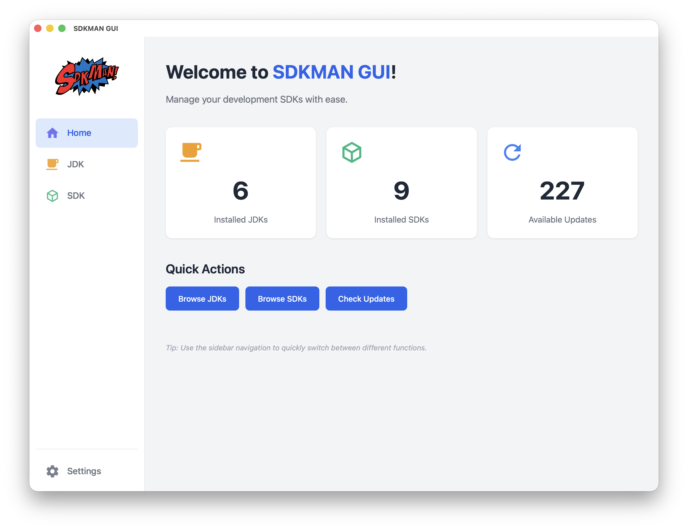
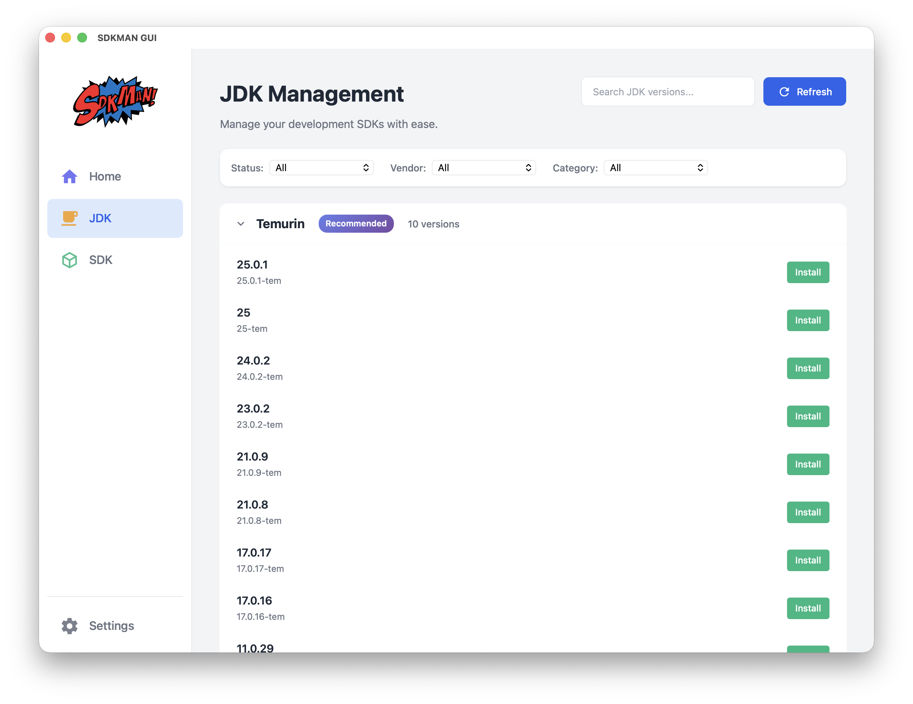
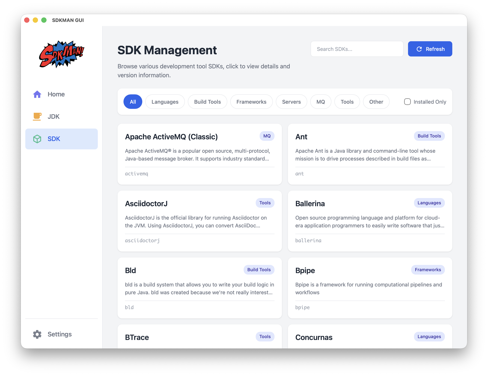
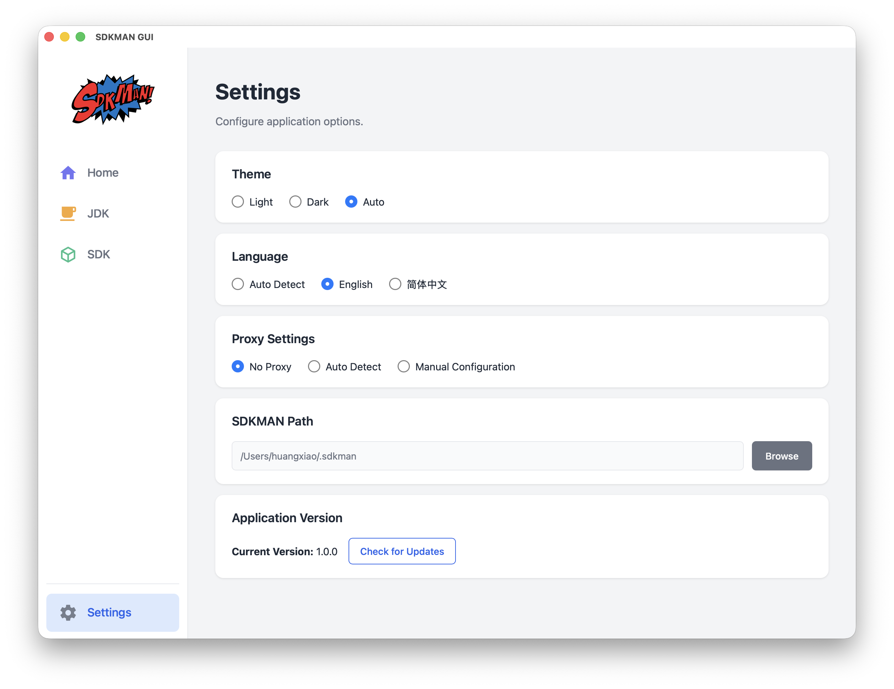

# SDKMAN GUI

**English** | [中文](README_ZH.md)

Cross-platform desktop application built with **Tauri + Vue + Rust**, offering an elegant GUI interface for [SDKMAN](https://github.com/sdkman).

## 🎬 Demo






**[📹 Watch Demo Video](https://github.com/user-attachments/assets/596a526b-a808-4beb-87f3-d9b257142874)**

## ✨ Features

- 💻 **Cross-platform** - Supports Windows, macOS, Linux
- 🎨 **Modern UI** - Beautiful interface design with Vue 3
- 🌍 **Internationalization** - Support for English and Chinese with automatic system language detection
- 🌗 **Theme Switching** - Support for light/dark themes with auto mode
- 📦 **SDK Management** - Browse, install, uninstall, and switch SDK versions
- 🔍 **Search & Filter** - Quickly find the SDKs you need
- 🏷️ **Category Browsing** - View SDKs by category (Java, Build Tools, Programming Languages, etc.)
- ⚡ **Native Performance** - Built with Rust backend for optimal performance
- 🔒 **Secure** - No external runtime dependencies, minimal attack surface

## 🛠️ Technology Stack

- **Frontend**: Vue 3 + TypeScript + Vite
- **Backend**: Rust + Tauri 2.0
- **UI Components**: Custom components with CSS variables
- **State Management**: Pinia
- **Internationalization**: Vue-i18n

## 📦 Installation

### macOS

**Manual Installation:**
Download the DMG file for your architecture from [Releases](https://github.com/youngledo/sdkman-gui-native/releases):
- Apple Silicon: `sdkman-gui_*_aarch64.dmg`
- Intel: `sdkman-gui_*_x64.dmg`

### Windows

Download and run the installer from [Releases](https://github.com/youngledo/sdkman-gui-native/releases):
- `sdkman-gui_*_x64-setup.exe`

### Linux

**Debian/Ubuntu:**
```bash
# Download the .deb package from releases
wget https://github.com/youngledo/sdkman-gui-native/releases/download/v1.0.0/sdkman-gui_1.0.0_amd64.deb
sudo dpkg -i sdkman-gui_1.0.0_amd64.deb
```

**AppImage:**
```bash
# Download the AppImage from releases
wget https://github.com/youngledo/sdkman-gui-native/releases/download/v1.0.0/sdkman-gui_1.0.0_amd64.AppImage
chmod +x sdkman-gui_1.0.0_amd64.AppImage
./sdkman-gui_1.0.0_amd64.AppImage
```

### Prerequisites

⚠️ **SDKMAN must be installed first:**
```bash
curl -s "https://get.sdkman.io" | bash
```

## 🌍 Internationalization

The application supports the following languages:

- 🇺🇸 English
- 🇨🇳 Simplified Chinese

Language is automatically selected based on system settings, but can also be manually switched in the settings page.

## 🎨 Themes

Three theme modes are supported:

- **Light Theme** - Bright and refreshing
- **Dark Theme** - Eye-friendly and comfortable
- **Auto Mode** - Follows system settings

## 📝 Usage Guide

### Discovering SDKs

1. Open the application, default landing on the "Home" page
2. Browse the available SDK list
3. Use category filters or search functionality to quickly locate SDKs
4. Click "Install" button to install an SDK

### Managing Installed SDKs

1. Navigate to the "JDK" or "SDK" page
2. View all installed SDKs and versions
3. You can:
   - Set default versions
   - Install new versions
   - Uninstall unwanted versions
   - Switch between versions

### SDK Details Management

1. Click on any SDK to view detailed information
2. Browse all available versions
3. Manage individual versions:
   - Install specific versions
   - Uninstall versions
   - Set versions as default
   - View installation status and progress

### Configuring the Application

1. Navigate to the "Settings" page
2. You can configure:
   - Interface theme
   - Display language
   - Proxy settings
   - SDKMAN installation path

## 🔧 Configuration File

Application configuration is saved in: `~/.config/sdkman-gui/config.json`

Configuration example:

```json
{
  "language": "en",
  "theme": "auto",
  "proxy_type": "none",
  "proxy_host": null,
  "proxy_port": null,
  "sdkman_path": "/Users/username/.sdkman"
}
```

## 🏗️ Development

### Prerequisites

- Node.js
- Rust
- npm

### Setup

```bash
# Clone the repository
git clone https://github.com/youngledo/sdkman-gui-native.git
cd sdkman-gui/sdkman-gui-tauri

# Install dependencies
npm install

# Run in development mode
npm run tauri dev

# Build for production
npm run tauri build
```

## 🙏 Acknowledgments

- [SDKMAN](https://sdkman.io/) - Excellent SDK management tool
- [Tauri](https://tauri.app/) - Build smaller, faster, and more secure desktop applications
- [Vue.js](https://vuejs.org/) - The Progressive JavaScript Framework
