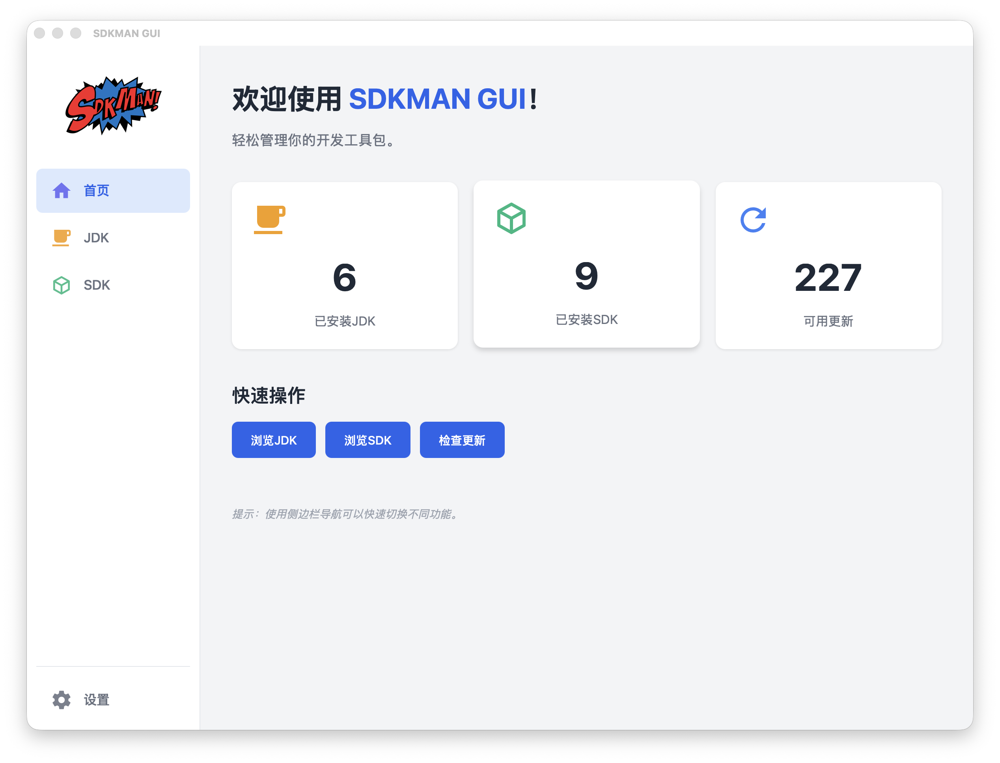
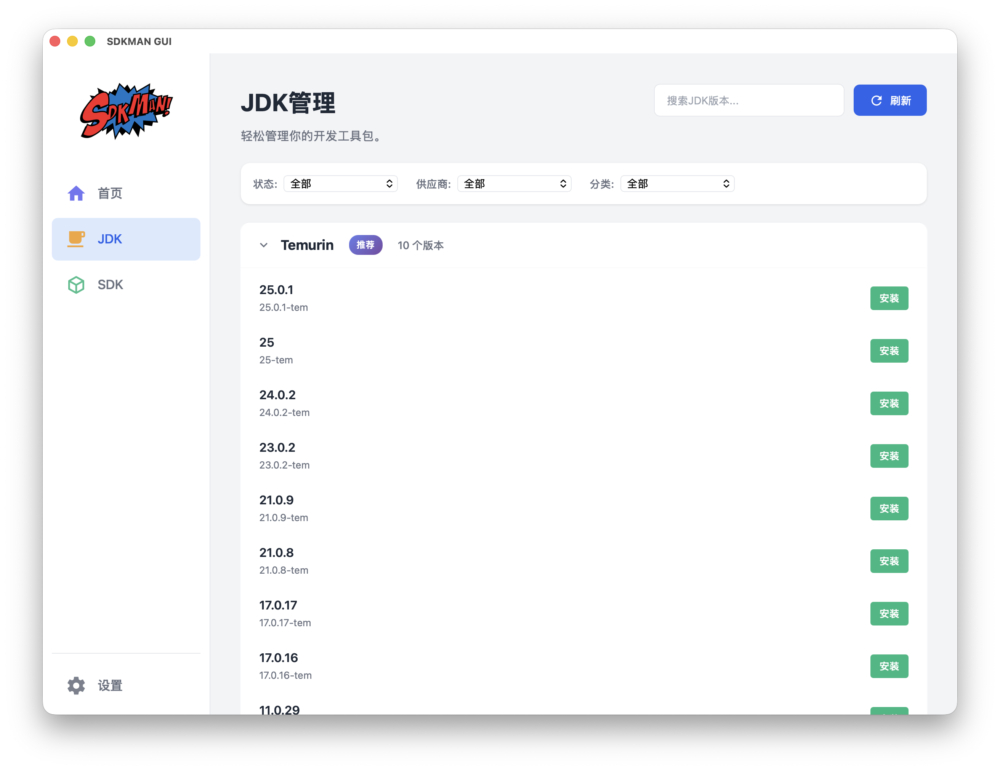
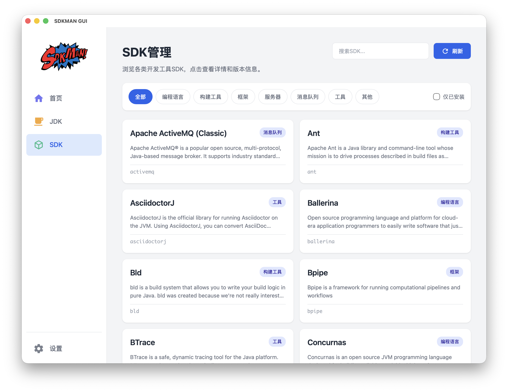
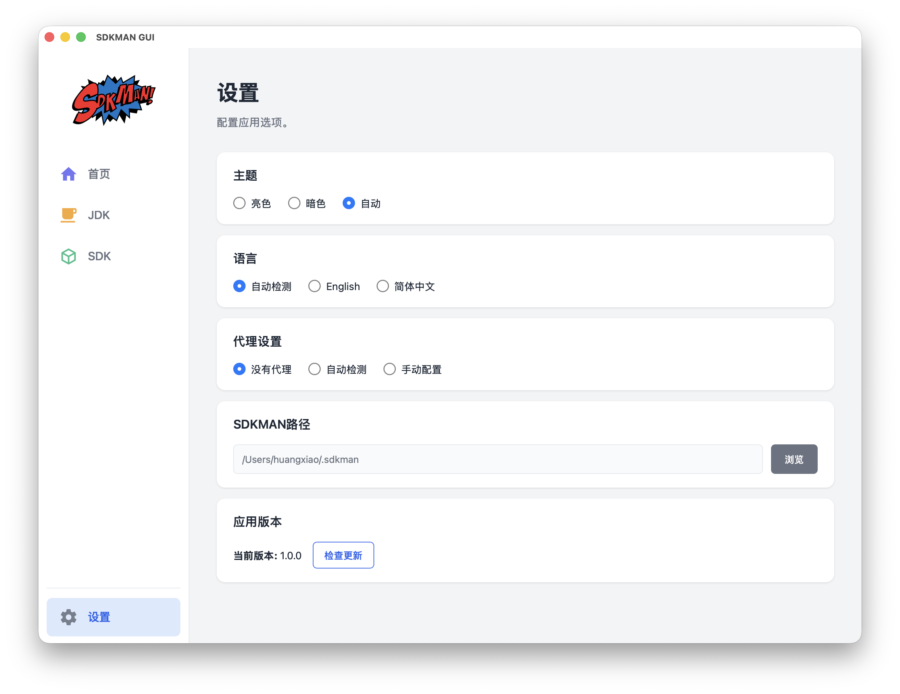

# SDKMAN GUI

[English](README.md) | **中文**

跨平台桌面应用，基于**Tauri + Vue + Rust**开发，为[SDKMAN](https://github.com/sdkman)提供优雅的图形化界面。

## 🎬 演示






**[📹 观看此视频](https://github.com/user-attachments/assets/596a526b-a808-4beb-87f3-d9b257142874)**

## ✨ 特性

- 💻 **跨平台** - 支持Windows、macOS、Linux
- 🎨 **现代化UI** - 基于Vue 3的精美界面设计
- 🌍 **国际化支持** - 支持中英文，自动检测系统语言
- 🌗 **主题切换** - 支持亮色/暗色主题及自动模式
- 📦 **SDK管理** - 浏览、安装、卸载、切换SDK版本
- 🔍 **搜索过滤** - 快速查找所需的SDK
- 🏷️ **分类浏览** - 按类别查看SDK（Java、构建工具、编程语言等）
- ⚡ **原生性能** - Rust后端提供最佳性能
- 🔒 **安全可靠** - 无外部运行时依赖，最小化攻击面

## 🛠️ 技术栈

- **前端**: Vue 3 + TypeScript + Vite
- **后端**: Rust + Tauri 2.0
- **UI组件**: 自定义组件 + CSS变量
- **状态管理**: Pinia
- **国际化**: Vue-i18n

## 📦 安装

### macOS

**手动安装：**
从 [Releases](https://github.com/youngledo/sdkman-gui-native/releases) 下载对应架构的DMG文件：
- Apple Silicon：`sdkman-gui_*_aarch64.dmg`
- Intel：`sdkman-gui_*_x64.dmg`

### Windows

从 [Releases](https://github.com/youngledo/sdkman-gui-native/releases) 下载并运行安装程序：
- `sdkman-gui_*_x64-setup.exe`

### Linux

**Debian/Ubuntu：**
```bash
# 从releases下载.deb包
wget https://github.com/youngledo/sdkman-gui-native/releases/download/v1.0.0/sdkman-gui_1.0.0_amd64.deb
sudo dpkg -i sdkman-gui_1.0.0_amd64.deb
```

**AppImage：**
```bash
# 从releases下载AppImage
wget https://github.com/youngledo/sdkman-gui-native/releases/download/v1.0.0/sdkman-gui_1.0.0_amd64.AppImage
chmod +x sdkman-gui_1.0.0_amd64.AppImage
./sdkman-gui_1.0.0_amd64.AppImage
```

### 前置要求

⚠️ **必须先安装SDKMAN：**
```bash
curl -s "https://get.sdkman.io" | bash
```

## 🌍 国际化

应用支持以下语言：

- 🇺🇸 English（英文）
- 🇨🇳 简体中文

语言会根据系统设置自动选择，也可以在设置页面手动切换。

## 🎨 主题

支持三种主题模式：

- **亮色主题**（Light）- 明亮清爽
- **暗色主题**（Dark）- 护眼舒适
- **自动模式**（Auto）- 跟随系统设置

## 📝 使用说明

### 发现SDK

1. 打开应用后，默认进入"首页"页面
2. 浏览可用的SDK列表
3. 使用分类筛选或搜索功能快速定位
4. 点击"安装"按钮即可安装SDK

### 管理已安装的SDK

1. 切换到"JDK"或"SDK"页面
2. 查看所有已安装的SDK和版本
3. 可以：
   - 设置默认版本
   - 安装新版本
   - 卸载不需要的版本
   - 切换版本

### SDK详情管理

1. 点击任意SDK查看详细信息
2. 浏览所有可用版本
3. 管理单个版本：
   - 安装特定版本
   - 卸载版本
   - 设置为默认版本
   - 查看安装状态和进度

### 配置应用

1. 切换到"设置"页面
2. 可配置：
   - 界面主题
   - 显示语言
   - 代理设置
   - SDKMAN路径

## 🔧 配置文件

应用配置保存在：`~/.config/sdkman-gui/config.json`

配置示例：

```json
{
  "language": "zh",
  "theme": "auto",
  "proxy_type": "none",
  "proxy_host": null,
  "proxy_port": null,
  "sdkman_path": "/Users/username/.sdkman"
}
```

## 🏗️ 开发

### 前置要求

- Node.js
- Rust
- npm

### 开始开发

```bash
# 克隆仓库
git clone https://github.com/youngledo/sdkman-gui-native-native.git
cd sdkman-gui-native

# 安装依赖
npm install

# 开发模式运行
npm run tauri dev

# 构建生产版本
npm run tauri build
```

## 🙏 致谢

- [SDKMAN](https://sdkman.io/) - 优秀的SDK管理工具
- [Tauri](https://tauri.app/) - 构建更小、更快、更安全的桌面应用
- [Vue.js](https://vuejs.org/) - 渐进式JavaScript框架
